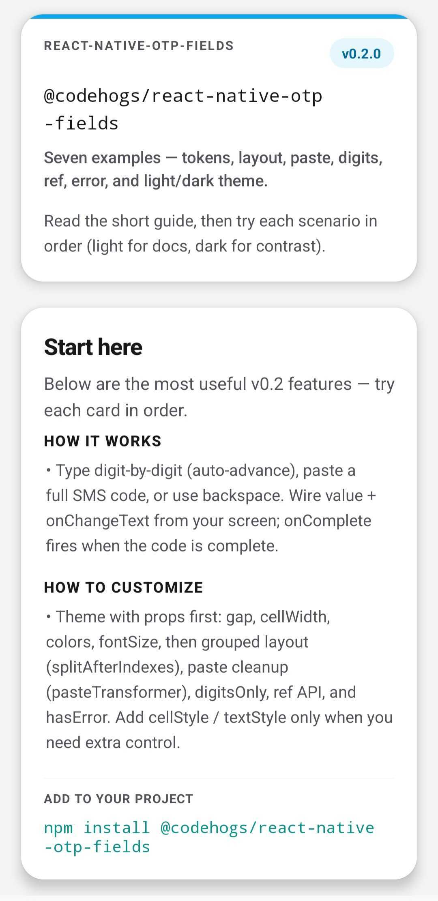
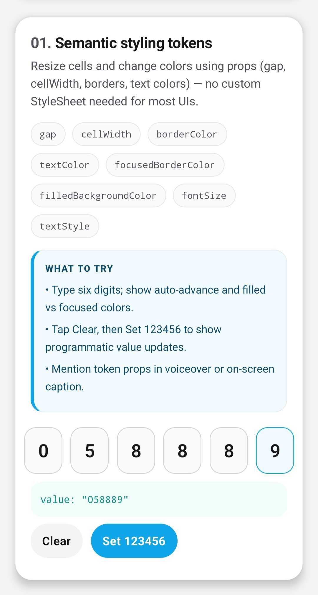
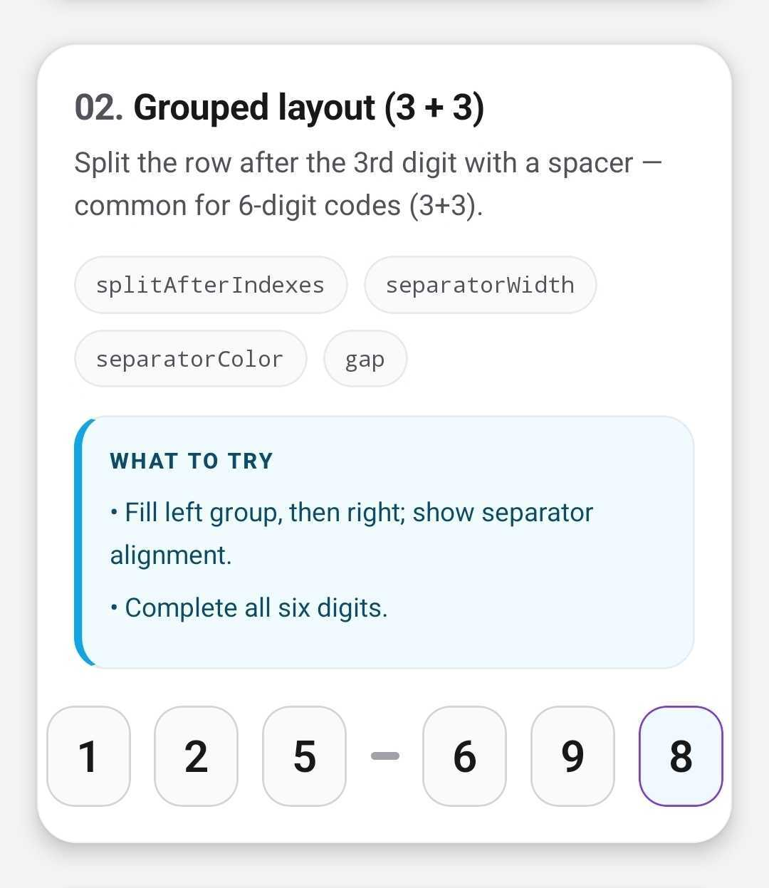
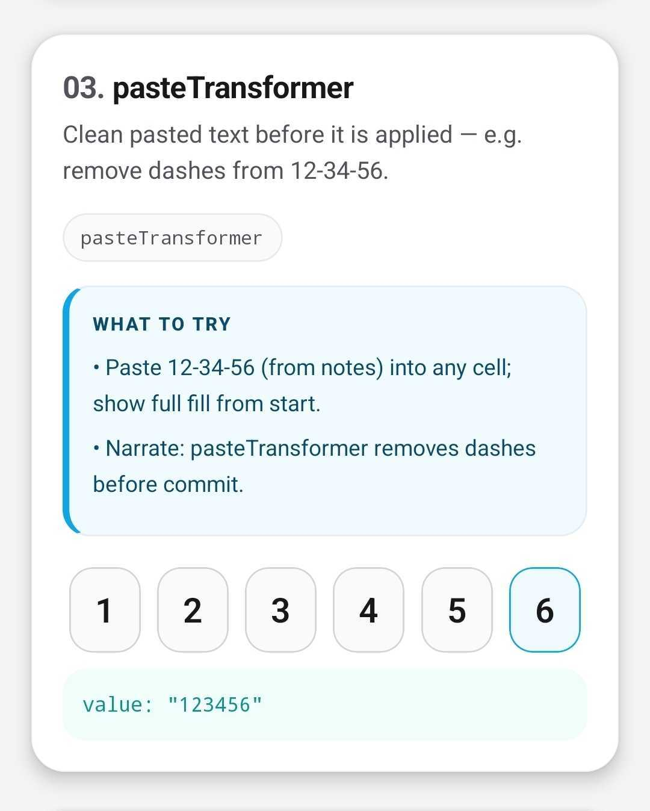
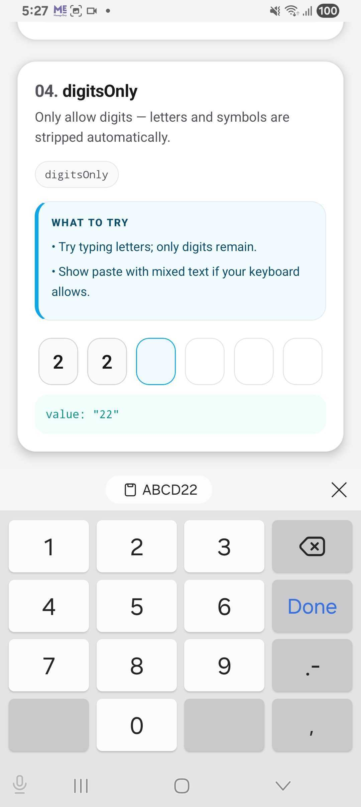
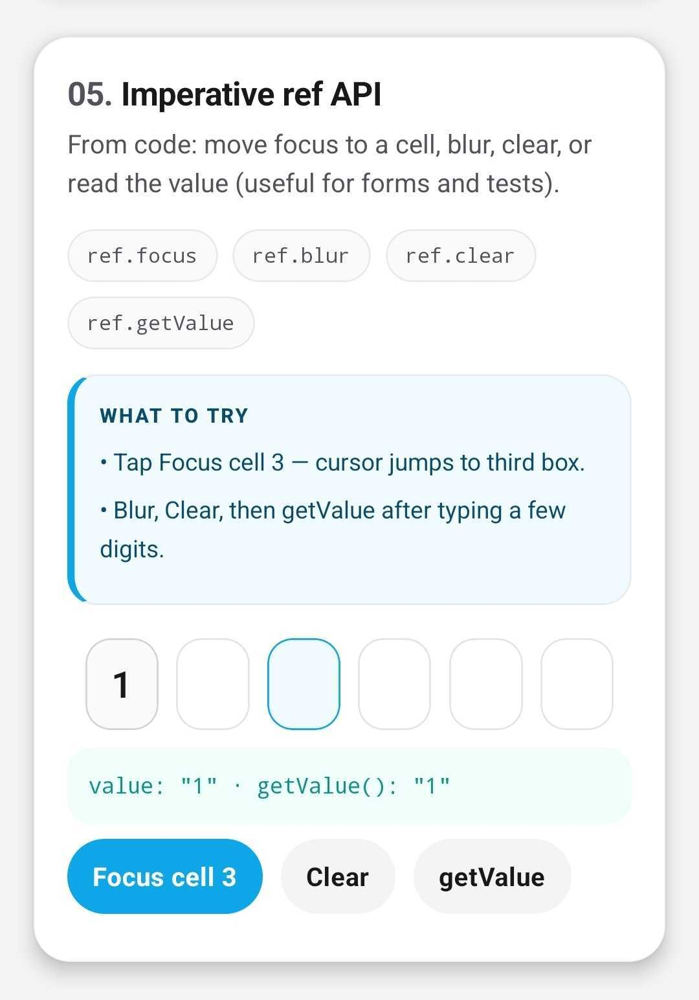
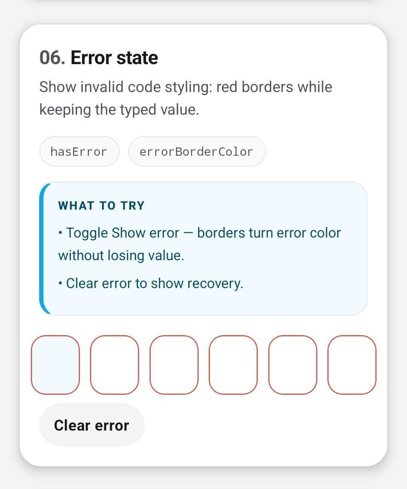
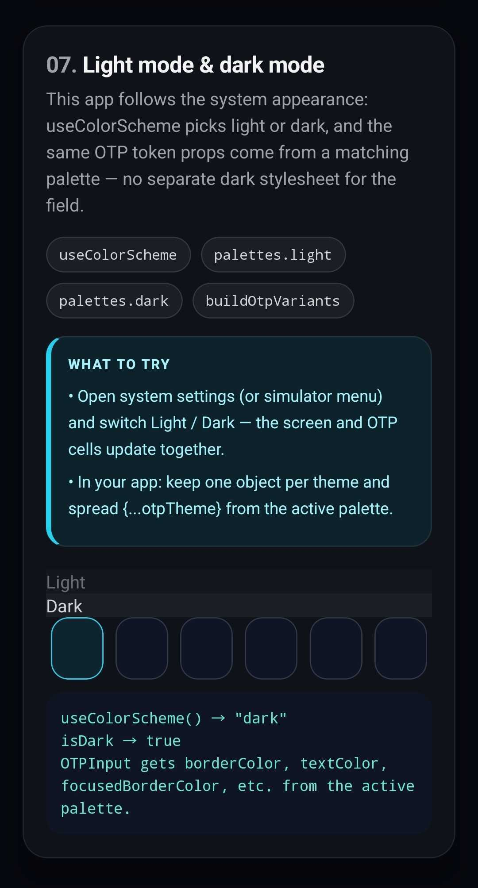

# @codehogs/react-native-otp-fields

**Lightweight and customizable OTP input for React Native.**

Fixed-length OTP cells with auto-advance, backspace navigation, paste support, controlled and uncontrolled usage, optional masking, error styling, semantic color/size tokens (so you rarely fight `StyleSheet`), optional **group separators** (like a 3+3 layout), **`pasteTransformer`** (same idea as [input-otp](https://github.com/guilhermerodz/input-otp)), optional **digits-only** filtering, an imperative **ref** API (`focus` / `blur` / `clear` / `getValue`), and a completion callback. No native modules—pure JavaScript on top of React Native `TextInput`.

## Requirements

- React ≥ 18
- React Native ≥ 0.74

## Installation

```bash
npm install @codehogs/react-native-otp-fields
```

```bash
yarn add @codehogs/react-native-otp-fields
```

## Quick start

```jsx
import React, { useState } from 'react';
import { View } from 'react-native';
import { OTPInput } from '@codehogs/react-native-otp-fields';

export default function App() {
  const [otp, setOtp] = useState('');

  return (
    <View style={{ padding: 24 }}>
      <OTPInput
        length={6}
        value={otp}
        onChangeText={setOtp}
        onComplete={(code) => console.log('Completed:', code)}
      />
    </View>
  );
}
```

## Screenshots

These captures come from the companion demo app (seven scenarios + overview). GitHub and npm don’t support a true interactive carousel in a README, so this is a **gallery** you can scroll—same order as the demo.

<table>
  <tr>
    <td align="center" width="50%">
      
      <br /><sub><b>Overview</b> — package intro, v0.2.0, how it works &amp; customize</sub>
    </td>
    <td align="center" width="50%">
      
      <br /><sub><b>01 · Semantic tokens</b> — <code>gap</code>, <code>cellWidth</code>, colors, <code>fontSize</code>, focus/filled states</sub>
    </td>
  </tr>
  <tr>
    <td align="center">
      
      <br /><sub><b>02 · Grouped layout (3+3)</b> — <code>splitAfterIndexes</code>, separator, <code>gap</code></sub>
    </td>
    <td align="center">
      
      <br /><sub><b>03 · pasteTransformer</b> — e.g. paste <code>12-34-56</code> → <code>123456</code></sub>
    </td>
  </tr>
  <tr>
    <td align="center">
      
      <br /><sub><b>04 · digitsOnly</b> — strip letters/symbols; numeric keyboard</sub>
    </td>
    <td align="center">
      
      <br /><sub><b>05 · Ref API</b> — <code>focus</code>, <code>blur</code>, <code>clear</code>, <code>getValue</code></sub>
    </td>
  </tr>
  <tr>
    <td align="center">
      
      <br /><sub><b>06 · Error state</b> — <code>hasError</code>, <code>errorBorderColor</code></sub>
    </td>
    <td align="center">
      
      <br /><sub><b>07 · Light &amp; dark</b> — palette props from <code>useColorScheme</code> / theme object</sub>
    </td>
  </tr>
</table>

## API

### `OTPInput`

| Prop | Type | Default | Description |
|------|------|---------|-------------|
| `length` | `number` | `6` | Number of OTP characters. |
| `value` | `string` | — | Controlled value (whitespace stripped; if `digitsOnly`, non-digits stripped). |
| `defaultValue` | `string` | `''` | Initial value when uncontrolled. |
| `onChangeText` | `(value: string) => void` | — | Called whenever the combined code changes. |
| `onComplete` | `(value: string) => void` | — | Called when `value` first reaches `length`; can fire again after edits and a new completion. |
| `autoFocus` | `boolean` | `false` | Focus the first cell on mount. |
| `editable` | `boolean` | `true` | Disables all cells when `false`. |
| `secureTextEntry` | `boolean` | `false` | Mask digits (PIN-style). |
| `keyboardType` | `TextInput` keyboard type | `'number-pad'` | e.g. `'number-pad'` or `'numeric'`. |
| `placeholder` | `string` | `''` | Placeholder per cell. |
| `hasError` | `boolean` | `false` | Applies error border (and `errorCellStyle`). |
| `testID` | `string` | — | Container `testID`; cells use `${testID}-cell-${index}`. |
| `digitsOnly` | `boolean` | `false` | Strip non-digits from input and from `value` / `defaultValue` when displaying. |
| `pasteTransformer` | `(pasted: string) => string` | — | Applied on **paste** (multi-character input). Example: `(t) => t.replace(/-/g, '')`. |
| `splitAfterIndexes` | `number[]` | — | e.g. `[2]` inserts a separator **after** the 3rd cell (indices are 0-based cell indexes). |
| `separator` | `ReactNode` | — | Custom node for each gap; default is a small rounded bar. Pass `null` and use `renderSeparator` to hide, or override. |
| `renderSeparator` | `({ afterIndex }) => ReactNode` | — | Full control per gap. |
| `separatorContainerStyle` | `ViewStyle` | — | Wrapper around the separator. |
| `separatorStyle` | `ViewStyle` | — | Extra styles for the **default** pill separator. |
| `separatorWidth` / `separatorHeight` / `separatorColor` | `number` / `string` | `12` / `4` / `#D0D5DD` | Default separator appearance. |
| `gap` | `number` | `8` | Space between cells (and around separators). |
| `cellWidth` / `cellHeight` | `number` | `48` / `56` | Cell size. |
| `borderRadius` / `borderWidth` | `number` | `12` / `1` | Cell shape. |
| `borderColor` | `string` | `#D0D5DD` | Default cell border. |
| `backgroundColor` | `string` | — | Cell background (optional). |
| `textColor` | `string` | `#101828` | Character color. |
| `placeholderTextColor` | `string` | `#999` | Placeholder color. |
| `focusedBorderColor` / `focusedBackgroundColor` | `string` | `#101828` / — | Focused cell. |
| `filledBorderColor` / `filledBackgroundColor` | `string` | — | When a cell has a character. |
| `errorBorderColor` | `string` | `#F04438` | When `hasError`. |
| `fontSize` / `fontFamily` | `number` / `string` | `20` / — | Typography shortcuts (still override with `textStyle`). |
| `caretHidden` | `boolean` | `false` | Passed through to each `TextInput`. |

**Override props** (merged after tokens): `containerStyle`, `cellStyle`, `focusedCellStyle`, `filledCellStyle`, `errorCellStyle`, `textStyle`.

### Ref (`forwardRef`)

Pass a ref to call:

| Method | Description |
|--------|-------------|
| `focus(index?)` | Focus cell `index` (default `0`). |
| `blur()` | Blur all cells. |
| `clear()` | Clears value (calls `onChangeText('')` in controlled mode; also resets completion tracking). |
| `getValue()` | Returns the current combined string. |

### Utilities

- **`clampOtpValue(text, length)`** — Strips whitespace and truncates.
- **`sanitizeOtpInput(text, length, options?)`** — Whitespace strip, optional `digitsOnly`, optional `pasteTransformer`, then truncate.
- **`normalizeStoredOtpValue(text, length, digitsOnly?)`** — For normalizing controlled `value` / `defaultValue`.

## Behavior

- **Auto-advance:** After a digit in a cell, focus moves to the next cell.
- **Backspace:** Clears the current cell if it has a digit; otherwise moves to the previous cell and clears it.
- **Paste:** Pasting a multi-character code into any cell fills from the start (up to `length`) and moves focus to the last filled cell.
- **SMS / OTP autofill:** Uses `textContentType="oneTimeCode"` (iOS) and `autoComplete` / `importantForAutofill` (Android) to cooperate with system OTP suggestions where the OS supports it.
- **Completion:** `onComplete` runs when the string length first reaches `length`; if the user edits the code, it can fire again after the next full completion.

## Styling and layout

Prefer **semantic props** (`gap`, `cellWidth`, `cellHeight`, `borderColor`, `textColor`, `focusedBorderColor`, `errorBorderColor`, …) for a design system–friendly setup; use `cellStyle` / `textStyle` when you need full control.

**Grouped layout (e.g. 3 + 3):**

```jsx
<OTPInput
  length={6}
  splitAfterIndexes={[2]}
  gap={10}
  cellWidth={44}
/>
```

Default cells are **48×56** with **`gap: 8`**. The row uses `alignItems: 'center'` so separators line up with cells.

## Controlled vs uncontrolled

- **Controlled:** Pass `value` + `onChangeText` (recommended when the code is stored in parent state or a form library).
- **Uncontrolled:** Omit `value` and optionally set `defaultValue`.

## Testing

With `testID="login-otp"`, the container has `testID="login-otp"` and cells have `testID="login-otp-cell-0"`, `login-otp-cell-1`, etc.

## TypeScript

Type definitions are included (`types/index.d.ts`).

## Local development (this repo)

```bash
npm install
npm run build
npm test
```

The package ships pre-built `lib/` output. `prepublishOnly` runs `build` and `tests` before `npm publish`; consumers do not need to compile the library.

Link into an app:

```bash
npm pack
# In your app: npm install /path/to/codehogs-react-native-otp-fields-0.2.0.tgz
```

Or use `yarn link` / `npm link` per your workflow.

## Publishing

1. Bump `version` in `package.json`.
2. `npm run build`
3. `npm publish --access public` (after `npm login`; scoped packages need `--access public` for a free public package).

Ensure `files` in `package.json` ships `lib`, `types`, `src` entry files, `src/assets` (for README images on npm), `README.md`, and `LICENSE`.

## License

MIT
